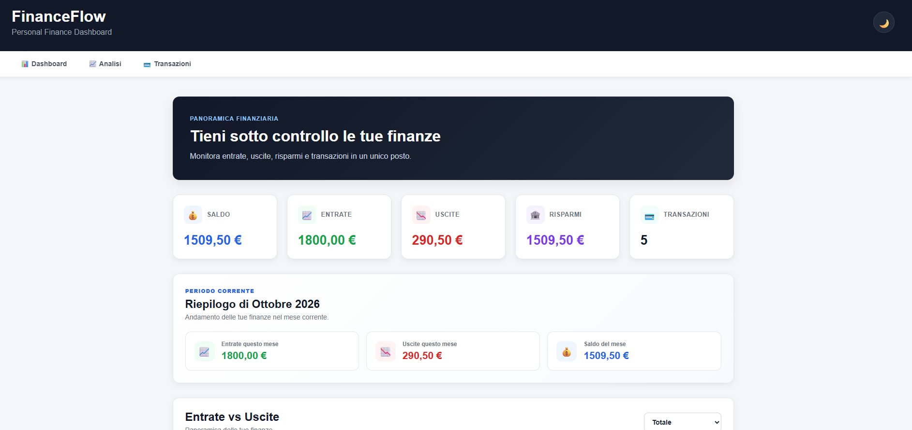
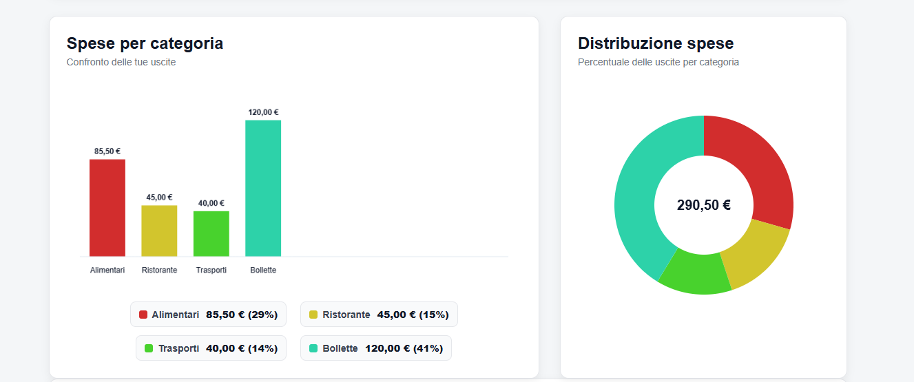

# 💸 FinanceFlow

## 📸 Preview

### Dashboard



### Charts and Budget




**A personal finance dashboard to track income, expenses, transactions, and monthly budgets.**

FinanceFlow is a responsive web application built with HTML, CSS, and JavaScript. It provides a clear overview of personal finances through interactive charts, transaction management, monthly summaries, and budget tracking.

## ✨ Features

* **Financial overview** — monitor balance, income, expenses, savings, and transaction count.
* **Transaction management** — add, edit, and delete transactions.
* **Search and filters** — find transactions and filter financial records.
* **Interactive charts** — visualize income and expenses across different time periods.
* **Category analytics** — explore spending patterns with category charts.
* **Monthly summary** — review monthly financial activity and compare it with the previous month.
* **Budget tracking** — set a monthly budget and monitor spending progress.
* **Spending insights** — identify spending categories and receive automatic spending summaries.
* **Dark mode** — switch between light and dark themes.
* **Persistent data** — save transactions and preferences in the browser using localStorage.
* **Responsive design** — use the dashboard on desktop and mobile screens.

## 🛠️ Technologies

* HTML5
* CSS3
* JavaScript (Vanilla JS)
* Chart.js, if included in the project
* Browser localStorage
* Git and GitHub

## 🚀 Getting Started

### Prerequisites

You need a modern web browser. XAMPP can be used to run the project locally through Apache.

### Run locally with XAMPP

1. Clone or download this repository.
2. Place the project folder inside your XAMPP `htdocs` directory.
3. Start Apache from the XAMPP Control Panel.
4. Open your browser and visit:

   `http://localhost/finance-flow/`

### Alternative

If the project does not require a local server, you can open `index.html` directly in your browser.

## 📁 Project Structure

```text
finance-flow/
├── index.html
├── style.css
├── app.js
└── README.md
```

## 💾 Data Storage

FinanceFlow uses the browser's `localStorage` to keep supported data available between visits on the same browser.

The project does not require a database or a backend server for its current functionality.

**Note:** Browser data is local to the browser and device. Clearing browser storage may remove saved data.

## 🎯 Project Goals

This project was created to practice and demonstrate:

* Building a responsive user interface.
* Manipulating the DOM with JavaScript.
* Managing application state and browser storage.
* Visualizing financial data.
* Implementing search, filtering, and transaction CRUD operations.
* Designing a consistent interface with light and dark themes.

## 🔮 Future Improvements

* Export transactions to CSV.
* Add financial reports and additional insights.
* Introduce automated testing.
* Improve accessibility and keyboard navigation.

## 👩‍💻 Author

**MariB3195**

GitHub: [@MariB3195](https://github.com/MariB3195)

---

*FinanceFlow — a personal finance dashboard built as a web development portfolio project.*
